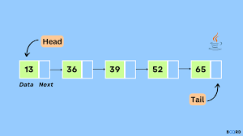

# Lösung
***

### 1)
#### Effizienz - Verbesserung

Um die Effizienz verbessern zu können, muss man zuerst verstehen, wie TemperaturVerwaltung und Collection-Klassen
funktionieren.

````java
public class Temperaturverwaltung {
    private final LinkedList<Temperatur> temperaturen;
    public Temperaturverwaltung() {
        temperaturen = new LinkedList<>();
    }
    public int fuegeHinzu(Temperatur t) {
        Iterator<Temperatur> ts = temperaturen.iterator();
        boolean schonEnthalten = false;
        while (ts.hasNext() && !schonEnthalten) {
            schonEnthalten = ts.next().wert() == t.wert();
        }
        if (!schonEnthalten) {
            temperaturen.add(t);
        }
        return temperaturen.size();
    }
}
````

Diese Klasse verwendet eine LinkedList um eine Vielzahl von Temperaturen zu speichern.
Eine LinkedList speichert Objekte (hier vom Typ Temperatur) in einer verketteten Liste, wo jedes Element
seinen Nachfolger kennt.



Hier sollte dann auffallen, dass wenn man z.B. ein Element entfernen möchte, man durch die gesamte Liste
iterieren müsste, bis man das Element gefunden hat um es dann zu löschen. (Zusätzlich zum neu linken der Elemente damit
die Lücke nicht mehr da ist)
Diese Ineffizienz ist auch bei der Methode `fuegeHinzu(Temperatur)` zu sehen, da durch die gesamte Liste iteriert wird,
um zu schauen, ob das Element schon vorhanden ist, da sich keine gleichen Temperaturen in der LinkedList befinden
sollen.

##### Welche Alternativen haben wir also?

Es gibt eig nur drei Collection Klassen zur Auswahl (laut der Vorlesung):
* Maps
* Sets
* Lists

**Lists** können wir ja zunächst streichen, da Diese für diesen Zweck ineffizient erscheinen.

**Maps** sind hier ebenfalls nicht geeignet, da man noch extra einen Schlüssel für jede Temperatur definieren
müsste, was unnötig ist.

**Sets** sind für diese Aufgabe ideal, da diese von Natur aus schon die Eigenschaft mitbringen, dass sie keine
doppelten Elemente enthalten. Dementsprechend entfällt das explizite Iterieren und Vergleichen.
(Ob wir uns für Tree- oder HashSets entscheiden ist egal. Da eine Sortierung nicht wichtig ist, nehmen wir ein HashSet)

Das Umstellen auf diese Datenstruktur sieht dann zuunächst so aus:
````java
public class TemperaturVerwaltung {
    private final HashSet<Temperatur> temperatures;

    public TemperaturVerwaltung(){
        temperatures = new HashSet<>();
    }

}
````

Jetzt muss nur noch die Methode angepasst werden:
````java
public int fuegeHinzu(Temperatur t){

        temperatures.add(t);
        return temperatures.size();
}
````

Das sind alle Änderungen in der Klasse _TemperaturVerwaltung_.
Allerdings würde es noch nicht zur gewünschten Änderung führen:

````java
TemperaturVerwaltung tv = new TemperaturVerwaltung();

Temperatur t1 = new Temperatur(32.3f);
Temperatur t2 = new Temperatur(12.4f);
Temperatur t3 = new Temperatur(35);
Temperatur t4 = new Temperatur(32.3f);

System.out.println(tv.fuegeHinzu(t1));
System.out.println(tv.fuegeHinzu(t2));
System.out.println(tv.fuegeHinzu(t3));
System.out.println(tv.fuegeHinzu(t4));
````

Erwarten tu ich eigentlich:
````
1
2
3
3
````
Da zwei Temperaturen gleich sind, sollte das HashSet reagieren und eins davon garnicht aufnehmen.

Bekommen tu ich:

````
1
2
3
4
````

Warum?

Vergleichen wir mal beide Instanzen:

````java
System.out.println(t1.equals(t4));

System.out.println(t1);
System.out.println(t4);
````
Ausgabe:
````
false

Temperatur@312b1dae
Temperatur@3941a79c
````

Das liegt daran, dass Java nicht weiss wie es Temperatur-Objekte zu interpretieren hat um diese entsprechend zu vergleichen.
In den unteren beiden Zeilen kann man gut erkennen, dass anhand des Hex-Codes nach dem @ beide Objekte anscheinend nicht
gleich sind. Doch wie können wir das beheben?

Jede Klasse erbt Methoden der Klasse _Object_. Dort befinden sich zwei essenzielle Methoden zum Vergleichen von
zwei Objekten derselben Klasse:
* `int hashCode()`
* `boolean equals(Object)`

Beide Methoden werden vom HashSet benutzt, um zu überprüfen ob sich das gleiche Element schon in seinem Speicher befindet.

Das Überschreiben sieht dann wie folgt für hashCode() aus:

````java
// Methode in der Klasse Temperatur
@Override
public int hashCode(){
    return (int)(t * 10000);
}
````
Der HashCode ist sowas wie der digitale Fingerabdruck. Da der Vergleich sich auf die Temperatur bezieht, macht
es Sinn diese Temperatur als Fingerabdruck zu nutzen. Hierbei multipliziere ich mit 10000 und typkonvertiere für
viele Nachkommastellen zu int, weil die Methode ein Integer zurückgibt.

**Warum nicht direkt typkonvertieren?**

Typkonvertierung in int sorgt dafür, dass schlichtweg die Nachkommastellen gelöscht werden.
Nach der Logik wäre dann 34.5 gleich 34.8, weil beide den Hashcode 34 hätten. Um das bestmöglichst zu verhindern,
verschiebt man das Komma weit nach rechts, sodass beim Beispiel die Hashcodes 345000 und 348000 rauskämen, was
zeigt, dass sie nicht den gleichen Fingerabdruck besitzen.

Überschreiben von equals(Object):

````java
@Override
public boolean equals(Object o){
    boolean isEquals = false;
    if(o instanceof Temperatur){
        isEquals = ((Temperatur)o).wert() == this.wert();
    }
    return isEquals;
}
````

Hier fallen zwei Sachen auf:
* instanceof
* Object als Parameter-Typ und die Typkonvertierung in Temperatur

Dieses Schlüsselwort `instanceof` gibt einen boolschen Wert zurück ob Ausdruck1 eine Instanz von Ausdruck2 ist.
In der if-Abfrage ist damit sichergestellt, dass das zu vergleichende Objekt auch wirklich eine Temperatur ist, oder
eine Kindklasse davon. (Wir wollen ja nicht Äpfel mit Birnen vergleichen 😥)
Das könnten wir verhindern, wenn wir den Parametertypen in Temperatur ändern, aber es geht aufgrund der
Notwendigkeit, die Methode `equals` überschreiben zu wollen, nicht.
Da wir `o.wert()` aufrufen möchten für den Temperaturwert, müssen wir deswegen einen Typecast machen, da
der aktuelle Typ `Object` die Methode `wert()` nicht kennt.

Alternativ kann man aber auch Folgendes machen:
````java
if(o instanceof Temperatur t){
    isEquals = t.wert() == this.wert();
}
````
* Dieser Weg ermöglicht uns einen direkten Typecast und macht den Code wesentlich lesbarer
  * Mit meiner Lösung wollte ich nur aufzeigen, dass man auf den Typen des Objektes achten muss!

Nun gibt mir die Ausgabe folgendes:

````
1
2
3
3
````

Was richtig ist!

### 2)
#### Verbote für Temperaturen unter dem absoluten Nullpunkt

Diese Aufgabe bedeutet, dass folgende Zeile nicht funktionieren darf:
````java
Temperatur t_error = new Temperatur(-300);
````

Weil dies beim Erzeugen relevant ist, müssen wir was am Konstruktor der Klasse _Temperatur_ machen.
Dafür bietet sich folgender Vorgang an:
* "Ist die übergebene Temperatur kleiner als -273.15°C ?"
* "Ja": Lass einen Fehler erscheinen und stopp das Programm.
* "Nein": "Mach weiter wie gehabt."

Das bedeutet, es bietet sich eine if-Abfrage an:

````java
if(t < -273.15f){
            
}
````

Um einen Fehler zu provozieren kann man mittels `throw` eine Exception werfen, die das Programm stoppt, falls diese
nicht behandelt wird.

````java
if(t < -273.15f){
            // Man kann auch eine Standard Exception werfen, aber das ist schlechter Stil.
            // Der Typ der Exception soll sich dem Kontext anpassen.
            throw new IllegalArgumentException("Es existieren keine Temperaturen unterhalb des Nullpunkts");
}
````

Die Ausgabe sieht nun wie folgt aus:

````
Exception in thread "main" java.lang.IllegalArgumentException: Es existieren keine Temperaturen unterhalb des Nullpunkts
````

Damit ist die Aufgabe gelöst 😊


